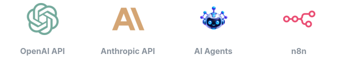

<div align="center">


# Olá, eu sou o Brayan 👋

### Backend Developer • AI Engineer • Data & Automation

Construo **APIs robustas**, **agentes de IA** e **fluxos de dados** com foco em arquitetura, desempenho e evolução sustentável.

<br/>


<br/>


[](https://github.com/BrayanDevZN)

</div>

---

## 🚀 Tech Stack

<div align="center">

### 🤖 IA, Agentes & Automação

<br/>

<p align="center">
  
</p>

<br/><br/>

### ⚙️ Backend & APIs

<br/>

<p align="center">
  
</p>

<br/><br/>

### 🗄️ Bancos de Dados & Cache

<br/>

<p align="center">
  
</p>

<br/><br/>

### 📊 Dados & Processamento

<br/>

<p align="center">
  
</p>

<br/><br/>

### ☁️ Infraestrutura & DevOps

<br/>

<p align="center">
  
</p>

<br/><br/>

### 🛠️ Ferramentas de Desenvolvimento

<br/>

<p align="center">
  
</p>

<br/><br/>

### 🏗️ Arquitetura & Padrões

<br/>

<p align="center">
  
</p>

</div>

---

## 👨‍💻 Sobre mim

Sou desenvolvedor com foco em **Backend Engineering**, usando Python para transformar regras de negócio em serviços confiáveis, bem estruturados e fáceis de evoluir.

Meu trabalho conecta quatro áreas que se complementam:

- **Backend:** APIs, autenticação, processamento assíncrono e integrações;
- **IA e automação:** agentes, LLMs, tool calling e fluxos com n8n;
- **Dados:** persistência, cache, pipelines e processamento analítico;
- **Arquitetura:** separação de responsabilidades, eventos e infraestrutura reproduzível.

Gosto de entender o que existe por trás das abstrações e escolher cada tecnologia pelo problema que ela resolve.

---

## 🎯 Foco atual

```text
Backend Engineering, AI & Distributed Systems
│
├── APIs seguras e observáveis
├── Clean Architecture e System Design
├── Agentes de IA e automação
├── Mensageria e arquiteturas orientadas a eventos
├── Concorrência e processamento assíncrono
├── Containers, CI/CD e orquestração
└── Escalabilidade e sistemas distribuídos
```

---

<h2 align="center">🌟 Principais Projetos</h2>

<h3 align="center">
  🤖 <a href="https://github.com/BrayanDevZN/AgentRH">AgentRH</a>
</h3>

<p align="center">
  <a href="https://github.com/BrayanDevZN/AgentRH">
    
  </a>
</p>

<p align="center">
  <strong>Recrutamento mais organizado, rápido e automatizado.</strong>
</p>

O **AgentRH** ajuda empresas a administrar processos seletivos em um único lugar. A plataforma organiza usuários, vagas e candidaturas, recebe currículos e utiliza inteligência artificial para apoiar a análise antes de comunicar o resultado ao candidato.

**Como ele ajuda o negócio:**

- centraliza vagas, candidatos e currículos;
- automatiza tarefas repetitivas da triagem;
- processa análises em segundo plano sem travar a experiência do usuário;
- envia o resultado da candidatura por e-mail;
- oferece áreas e permissões diferentes para candidatos e administradores;
- protege o acesso com autenticação segura e 2FA opcional;
- mantém qualidade por meio de testes automatizados no fluxo de entrega.

**Stack:** Python • FastAPI • PostgreSQL • Redis • Celery • OpenAI • Docker • GitHub Actions

<p align="center">
  <a href="https://github.com/BrayanDevZN/AgentRH"><b>Explorar o repositório →</b></a>
</p>

<br/>

---

<br/>

<h3 align="center">
  🧠 <a href="https://github.com/BrayanDevZN/AiAgenteSelector">AiAgentSelector</a>
</h3>

<p align="center">
  <a href="https://github.com/BrayanDevZN/AiAgenteSelector">
    
  </a>
</p>

<p align="center">
  <strong>O modelo de IA certo para cada tarefa, sem complicar a integração.</strong>
</p>

O **AiAgentSelector** funciona como uma camada inteligente entre uma aplicação e os modelos da OpenAI. O cliente envia sua solicitação para uma única API, e o serviço avalia a complexidade da tarefa antes de escolher o modelo mais adequado para executá-la.

**Como ele ajuda o negócio:**

- evita usar modelos mais caros em tarefas simples;
- direciona solicitações complexas para modelos com maior capacidade;
- busca equilibrar custo, velocidade e qualidade das respostas;
- oferece uma única integração para diferentes modelos;
- pode ajustar automaticamente o nível de detalhe da resposta;
- permite otimizar a solicitação antes da execução;
- controla o volume de chamadas com limites compartilhados no Redis.

Pode ser usado em **chatbots, assistentes internos, automações, ferramentas de desenvolvimento e produtos de geração de conteúdo**.

**Stack:** Python • FastAPI • OpenAI Responses API • Redis • Pydantic • Docker

<p align="center">
  <a href="https://github.com/BrayanDevZN/AiAgenteSelector"><b>Explorar o repositório →</b></a>
</p>

<br/>

---

<br/>

<h3 align="center">
  🔎 <a href="https://github.com/BrayanDevZN/SearchAgentN8N">Search Agent N8N</a>
</h3>

<p align="center">
  <a href="https://github.com/BrayanDevZN/SearchAgentN8N">
    
  </a>
</p>

<p align="center">
  <strong>Da pergunta ao relatório pronto no e-mail, de forma automática.</strong>
</p>

O **Search Agent N8N** recebe um tema por uma API protegida, pesquisa informações e imagens atuais na web, organiza o conteúdo em um relatório visual e envia o resultado diretamente para o e-mail informado.

**Como ele ajuda o negócio:**

- automatiza pesquisas que normalmente exigiriam trabalho manual;
- reúne informações e imagens relacionadas ao tema solicitado;
- transforma os resultados em um relatório HTML pronto para leitura;
- entrega o conteúdo automaticamente pelo Gmail;
- reutiliza resultados recentes para evitar processamento duplicado;
- protege o acesso com autenticação JWT e validação dos dados;
- permite executar todo o fluxo de maneira reproduzível com Docker.

Pode ser usado para **pesquisa de mercado, levantamento de tendências, produção de conteúdo, inteligência competitiva e relatórios internos**.

**Stack:** n8n • OpenAI • Redis • Gmail • Docker Compose • Python • JWT

<p align="center">
  <a href="https://github.com/BrayanDevZN/SearchAgentN8N"><b>Explorar o repositório →</b></a>
</p>

<br/>

---

<br/>

<h3 align="center">
  ⏱️ <a href="https://github.com/BrayanDevZN/CronServer">CronServer</a>
</h3>

<p align="center">
  <a href="https://github.com/BrayanDevZN/CronServer">
    
  </a>
</p>

<p align="center">
  <strong>Automação confiável para tarefas e integrações recorrentes.</strong>
</p>

O **CronServer** permite cadastrar chamadas HTTP que precisam ser executadas automaticamente em intervalos definidos. A aplicação agenda cada rotina, distribui o processamento entre workers e mantém um histórico dos resultados para acompanhamento.

**Como ele ajuda o negócio:**

- automatiza sincronizações e tarefas recorrentes entre sistemas;
- evita a execução manual de rotinas operacionais;
- permite configurar URL, método, cabeçalhos e dados enviados;
- processa tarefas em segundo plano sem bloquear a API;
- repete automaticamente chamadas que falharem;
- registra o resultado das execuções para consulta posterior;
- protege cada agendamento com um token individual;
- distribui a carga entre workers conforme a demanda.

Pode ser usado para **sincronização de dados, disparo de webhooks, atualização de catálogos, rotinas de manutenção e integrações agendadas**.

**Stack:** Python • FastAPI • Celery • Redis • PostgreSQL • Docker • Nginx • JWT

<p align="center">
  <a href="https://github.com/BrayanDevZN/CronServer"><b>Explorar o repositório →</b></a>
</p>

<br/>

---

<br/>

<h3 align="center">
  🛡️ <a href="https://github.com/BrayanDevZN/N8n_server">n8n Secure Gateway</a>
</h3>

<p align="center">
  <a href="https://github.com/BrayanDevZN/N8n_server">
    
  </a>
</p>

<p align="center">
  <strong>Uma camada de proteção para executar e publicar automações n8n com mais controle.</strong>
</p>

O **n8n Secure Gateway** protege uma instância n8n antes que as requisições cheguem às automações. Ele combina proxy reverso, verificação de acesso, limitação de tráfego e bloqueio opcional de IPs reincidentes.

**Como ele funciona:**

1. O cliente envia uma requisição para o Nginx, que funciona como única entrada pública.
2. Antes de encaminhar a requisição, o Nginx solicita uma verificação interna à API FastAPI.
3. A API consulta no Redis os limites globais e individuais daquele IP.
4. Se o acesso estiver dentro dos limites, o Nginx encaminha a requisição original ao n8n.
5. Quando um IP ultrapassa o rate limit, a violação é registrada e a requisição é recusada.
6. Com o bloqueio ativado, o IP é bloqueado ao atingir o número configurado de reincidências.

Por exemplo, com `block_limit=4`, um IP que estourar o rate limit quatro vezes entra na lista de bloqueio e deixa de conseguir acessar o serviço.

**Como ele ajuda o negócio:**

- reduz o risco de abuso contra webhooks e automações públicas;
- impede que o n8n fique diretamente exposto à internet;
- permite configurar limites globais e por IP;
- bloqueia automaticamente clientes que repetem comportamentos abusivos;
- preserva workflows, usuários e credenciais em um volume persistente;
- entrega uma infraestrutura reutilizável para diferentes automações.

**Stack:** Python • FastAPI • Nginx • Redis • n8n • Docker Compose

<p align="center">
  <a href="https://github.com/BrayanDevZN/N8n_server"><b>Explorar o repositório →</b></a>
</p>

---

## 🧩 Como construo sistemas

Começo pelo domínio e pelos requisitos do sistema. Depois defino limites, responsabilidades, dados e integrações; a escolha das ferramentas vem como consequência.

Um fluxo típico separa entrada, validação, regras de negócio e infraestrutura:

```text
Request
   │
   ▼
┌───────────────┐
│ Nginx / API   │
│    Gateway    │
└───────┬───────┘
        │
        ▼
┌───────────────┐
│    FastAPI    │
│  HTTP Layer   │
└───────┬───────┘
        │
        ▼
┌───────────────┐
│  Application  │
│   Services    │
└───────┬───────┘
        │
   ┌────┴─────────────┐
   │                  │
   ▼                  ▼
┌─────────┐      ┌──────────────┐
│  Redis  │      │ Persistence  │
│  Cache  │      │ SQL / NoSQL  │
└─────────┘      └──────────────┘
```

### ⚙️ Backend & APIs

Com **Python, FastAPI, Celery, Pydantic e SQLAlchemy**, desenvolvo APIs e tarefas assíncronas pensando no comportamento do sistema como um todo — não apenas nos endpoints.

Minhas principais preocupações são:

- contratos e validação de dados;
- autenticação, autorização e segurança;
- separação de responsabilidades e regras de negócio;
- processamento assíncrono e integrações externas;
- tratamento de erros, logs e observabilidade;
- testes, desempenho e evolução da aplicação.

---

### ⚡ Cache & Persistência

Uso **PostgreSQL** para dados relacionais, **MongoDB** quando o modelo documental faz sentido e **Redis** para acelerar operações que se beneficiam de acesso em memória.

```text
              ┌────── HIT ──────► Response
              │
Request ──► Redis
              │
              └────── MISS
                       │
                       ▼
                  PostgreSQL
                       │
                       ▼
                  Update Cache
                       │
                       ▼
                    Response
```

Além de cache, Redis pode apoiar **TTL, contadores, rate limiting e estruturas temporárias**. A fonte de verdade continua sendo definida explicitamente, evitando inconsistência entre camadas.

---

### 🤖 IA & Agentes

Na área de IA, trabalho com **OpenAI API**, **Anthropic API**, agentes, ferramentas e automações. Trato o modelo como um componente da aplicação, mantendo no backend tudo o que precisa ser previsível, validável e seguro.

```text
Application
     │
     ▼
┌──────────────┐
│   Backend    │
└──────┬───────┘
       │
       ▼
┌──────────────┐
│ Agent / Flow │
└──────┬───────┘
       │
   ┌───┴───────────────┐
   │                   │
   ▼                   ▼
  LLM              Tools / APIs
   │                   │
   └─────────┬─────────┘
             │
             ▼
          Response
```

Meu foco está em **integração de LLMs, design de agentes, tool calling, automação e orquestração de fluxos**.

---

### 📊 Dados

Para análise e processamento de dados, trabalho com **Pandas, NumPy, Polars e Apache Spark**, escolhendo a ferramenta de acordo com o volume e o tipo de transformação.

Procuro organizar processamento como um fluxo claro:

```text
Raw Data
   │
   ▼
Extraction
   │
   ▼
Cleaning
   │
   ▼
Validation
   │
   ▼
Transformation
   │
   ▼
Processed Data
   │
   ├──► Analytics
   ├──► Database
   └──► API
```

O objetivo é manter pipelines legíveis, validáveis e preparados para alimentar análises, bancos de dados e APIs.

---

### 🐳 Infraestrutura & Ambiente

Uso **Docker** para ambientes reproduzíveis, **Kubernetes** para orquestração, **Nginx** como servidor web e proxy reverso, e **Apache Kafka** em fluxos orientados a eventos. O ciclo de desenvolvimento passa por Linux, Git/GitHub e automações de CI/CD com **GitHub Actions**.

Gosto de enxergar além do código da aplicação:

```text
Source Code
    │
    ▼
Tests & CI/CD
    │
    ▼
Docker Image
    │
    ▼
Nginx / Kubernetes
    │
    ▼
Application
    │
    ├── Database
    ├── Cache
    ├── Kafka
    └── External Services
```

> **Primeiro o problema. Depois a arquitetura. Por último, as ferramentas.**

---

## 📈 GitHub em números

<div align="center">


<br/><br/>


</div>

---

## 🤝 Vamos conversar?

Se você gosta de backend, arquitetura, inteligência artificial ou dados, fique à vontade para acompanhar meus projetos e trocar ideias comigo pelo GitHub.

<div align="center">

<a href="https://github.com/BrayanDevZN">
  
</a>
<br/>
<sub><b>@BrayanDevZN</b></sub>

</div>

---

<div align="center">

### `Understand. Design. Build. Improve.`

</div>
