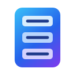

<div align="center">


# Olá, eu sou o Brayan 👋

### Backend Developer | AI Engineer | Data Analytics

Construindo sistemas, APIs e soluções com foco em **arquitetura, performance e escalabilidade**.

<br/>


<br/>


[](https://github.com/BrayanDevZN)

</div>

---

## 🚀 Tech Stack

<div align="center">

### 🤖 IA, Agentes & Automação

<br/>

<table align="center">
  <tr>
    <td align="center" width="130">
      <br/>
      <sub><b>OpenAI API</b></sub>
    </td>
    <td align="center" width="130">
      <br/>
      <sub><b>AI Agents</b></sub>
    </td>
    <td align="center" width="130">
      <br/>
      <sub><b>n8n</b></sub>
    </td>
  </tr>
</table>

<br/><br/>

### ⚙️ Backend & APIs

<br/>

<table align="center">
  <tr>
    <td align="center" width="130"><br/><sub><b>Python</b></sub></td>
    <td align="center" width="130"><br/><sub><b>FastAPI</b></sub></td>
    <td align="center" width="130"><br/><sub><b>Pydantic</b></sub></td>
    <td align="center" width="130"><br/><sub><b>SQLAlchemy</b></sub></td>
  </tr>
</table>

<br/><br/>

### 🗄️ Bancos de Dados & Cache

<br/>

<table align="center">
  <tr>
    <td align="center" width="130"><br/><sub><b>PostgreSQL</b></sub></td>
    <td align="center" width="130"><br/><sub><b>MongoDB</b></sub></td>
    <td align="center" width="130"><br/><sub><b>Redis</b></sub></td>
    <td align="center" width="130"><br/><sub><b>SQLite</b></sub></td>
  </tr>
</table>

<br/><br/>

### 📊 Dados & Processamento

<br/>

<table align="center">
  <tr>
    <td align="center" width="130"><br/><sub><b>Pandas</b></sub></td>
    <td align="center" width="130"><br/><sub><b>NumPy</b></sub></td>
    <td align="center" width="130"><br/><sub><b>Polars</b></sub></td>
    <td align="center" width="130"><br/><sub><b>Apache Spark</b></sub></td>
  </tr>
</table>

<br/><br/>

### ☁️ Infraestrutura & DevOps

<br/>

<table align="center">
  <tr>
    <td align="center" width="130"><br/><sub><b>Docker</b></sub></td>
    <td align="center" width="130"><br/><sub><b>Kubernetes</b></sub></td>
    <td align="center" width="130"><br/><sub><b>Apache Kafka</b></sub></td>
    <td align="center" width="130"><br/><sub><b>Nginx</b></sub></td>
    <td align="center" width="130"><br/><sub><b>CI/CD</b></sub></td>
  </tr>
</table>

<br/><br/>

### 🏗️ Arquitetura & Padrões

<br/>

<table align="center">
  <tr>
    <td align="center" width="180"><br/><sub><b>Clean Architecture</b></sub></td>
    <td align="center" width="180"><br/><sub><b>Event-Driven</b></sub></td>
    <td align="center" width="180"><br/><sub><b>Monolithic</b></sub></td>
  </tr>
</table>

<br/><br/>

### 🛠️ Ferramentas de Desenvolvimento

<br/>

<table align="center">
  <tr>
    <td align="center" width="130"><br/><sub><b>Linux</b></sub></td>
    <td align="center" width="130"><br/><sub><b>Git</b></sub></td>
    <td align="center" width="130"><br/><sub><b>GitHub</b></sub></td>
  </tr>
</table>

</div>

---

## 👨‍💻 Sobre mim

Sou desenvolvedor com foco em **Backend Engineering**, trabalhando principalmente com **Python** e desenvolvimento de APIs.

Gosto de entender o que acontece por trás das abstrações: arquitetura de sistemas, HTTP, autenticação, caching, bancos de dados, mensageria, processamento assíncrono e infraestrutura.

Além de backend, tenho experiência com **desenvolvimento de agentes de IA** usando a API da OpenAI, engenharia e processamento de dados, e automações.

* 🤖 Desenvolvo **agentes de IA** e integrações com LLMs (OpenAI API)
* 🔭 Atualmente aprofundando conceitos de **sistemas distribuídos** e infraestrutura
* 🌱 Sempre estudando novas formas de escalar e otimizar sistemas
* 💬 Pergunte-me sobre Python, APIs, arquitetura de backend, IA e dados
* ⚡ Fun fact: gosto de entender o "porquê" por trás de cada abstração

---

## 🧠 O que estou estudando

```text
Backend Engineering & AI
│
├── API Design (FastAPI, Pydantic)
├── AI Agents & LLM Integration (OpenAI API)
├── Authentication & Security
├── Caching
├── Messaging & Event Streaming (Kafka)
├── Container Orchestration (Kubernetes)
├── Concurrency
├── System Design
└── Distributed Systems
```

---

## 🛠️ Como eu trabalho

Gosto de construir sistemas pensando primeiro no **problema e na arquitetura**, e só depois nas ferramentas.

No backend, procuro separar responsabilidades entre entrada de dados, regras de negócio, persistência, cache e integrações externas.

```text
Request
   │
   ▼
┌───────────────┐
│    FastAPI    │
│  HTTP / API   │
└───────┬───────┘
        │
        ▼
┌───────────────┐
│   Pydantic    │
│  Validation   │
└───────┬───────┘
        │
        ▼
┌───────────────┐
│ Business Logic│
│   Services    │
└───────┬───────┘
        │
   ┌────┴─────────────┐
   │                  │
   ▼                  ▼
┌─────────┐      ┌──────────┐
│  Redis  │      │SQLAlchemy│
│  Cache  │      │   ORM    │
└─────────┘      └────┬─────┘
                      │
                      ▼
                ┌───────────┐
                │PostgreSQL │
                └───────────┘
```

### ⚙️ Backend & APIs

Com **Python, FastAPI, Pydantic e SQLAlchemy**, trabalho com desenvolvimento de APIs pensando não apenas no endpoint, mas no comportamento do sistema como um todo.

Isso inclui:

* organização e separação de responsabilidades;
* autenticação e autorização;
* validação e modelagem de dados;
* caching e invalidação de cache;
* rate limiting;
* processamento assíncrono;
* integração com serviços e APIs externas;
* tratamento de erros e logging;
* acesso e persistência de dados.

---

### ⚡ Cache & Persistência

Uso **PostgreSQL** para persistência relacional e **Redis** quando existe vantagem real em manter informações em memória.

```text
              ┌────── HIT ──────► Response
              │
Request ──► Redis
              │
              └────── MISS
                       │
                       ▼
                  PostgreSQL
                       │
                       ▼
                  Update Cache
                       │
                       ▼
                    Response
```

Além de caching, utilizo Redis para **TTL, contadores, rate limiting e estruturas temporárias**.

A ideia é evitar consultas e processamento desnecessários sem transformar cache em fonte de verdade.

---

### 🤖 IA & Agentes

Na parte de IA, trabalho principalmente com a **OpenAI API**, integração de LLMs, agentes e automações.

Procuro tratar o modelo como **um componente da aplicação**, mantendo lógica determinística no backend sempre que ela não precisa depender de IA.

```text
Application
     │
     ▼
┌──────────────┐
│   Backend    │
└──────┬───────┘
       │
       ▼
┌──────────────┐
│ Agent / Flow │
└──────┬───────┘
       │
   ┌───┴───────────────┐
   │                   │
   ▼                   ▼
  LLM              Tools / APIs
   │                   │
   └─────────┬─────────┘
             │
             ▼
          Response
```

Meu foco está em **LLM Integration, Agent Design, tool calling, automação e orquestração**.

---

### 📊 Dados

Para análise e processamento de dados trabalho com **Pandas, NumPy, Polars e Apache Spark**.

Procuro organizar processamento como um fluxo claro:

```text
Raw Data
   │
   ▼
Extraction
   │
   ▼
Cleaning
   │
   ▼
Validation
   │
   ▼
Transformation
   │
   ▼
Processed Data
   │
   ├──► Analytics
   ├──► Database
   └──► API
```

A ferramenta depende do problema e do volume de dados, em vez de existir uma biblioteca padrão para qualquer situação.

---

### 🐳 Infraestrutura & Ambiente

Uso **Docker** para criar ambientes isolados e reproduzíveis, **Kubernetes** para orquestração de containers, **Nginx** como servidor web e proxy reverso, e **Apache Kafka** para mensageria e processamento orientado a eventos. **Linux** é meu ambiente de desenvolvimento, com **Git/GitHub** no versionamento e na organização dos projetos.

Gosto de enxergar além do código da aplicação:

```text
Code
 │
 ▼
Application
 │
 ├── Database
 ├── Cache
 ├── Kafka
 └── External Services
 │
 ▼
Container
 │
 ▼
Kubernetes
 │
 ▼
Production
```

> **Primeiro entendo o problema. Depois escolho a ferramenta. Complexidade precisa ter motivo.**

---

## 📊 Estatísticas do GitHub

<div align="center">


</div>

<div align="center">


</div>

---

## 📫 Conecte-se comigo

<div align="center">

[](#)

[](#)

</div>

---

<div align="center">

### `Code. Build. Learn. Repeat.`

</div>
